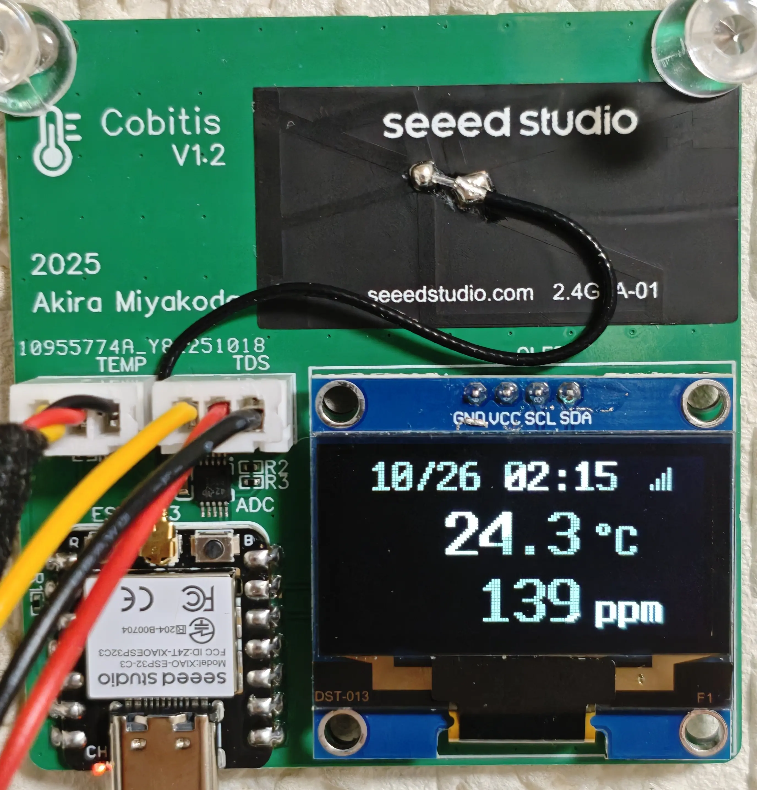
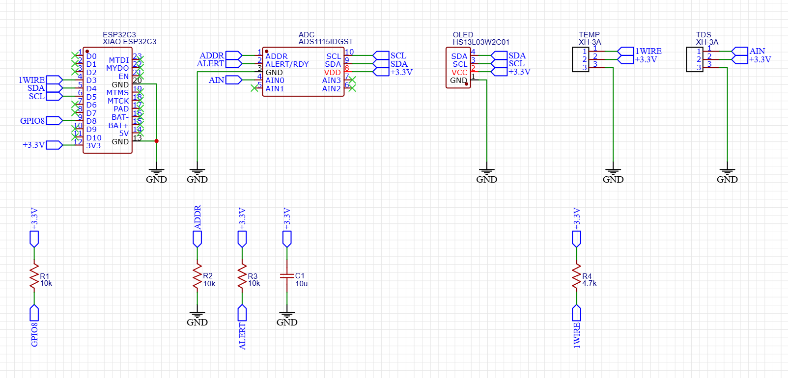

# Cobitis ESP32

[XIAO ESP32C3](https://wiki.seeedstudio.com/XIAO_ESP32C3_Getting_Started/) based aquarium tank monitor

## Components

* Seeed Studio [XIAO ESP32C3](https://wiki.seeedstudio.com/XIAO_ESP32C3_Getting_Started/) Microcontroller
* Analog Devices [DS18B20](https://www.analog.com/en/products/ds18b20.html) Digital Thermometer
* DFRobot [SEN0244](https://wiki.dfrobot.com/gravity__analog_tds_sensor___meter_for_arduino_sku__sen0244) Analog TDS meter
* SH1106 based 128x64 OLED Display
* Texas Instruments [ADS1115IDGST](https://www.ti.com/product/ADS1115/part-details/ADS1115IDGST) Analog digital converter

## Schematic

